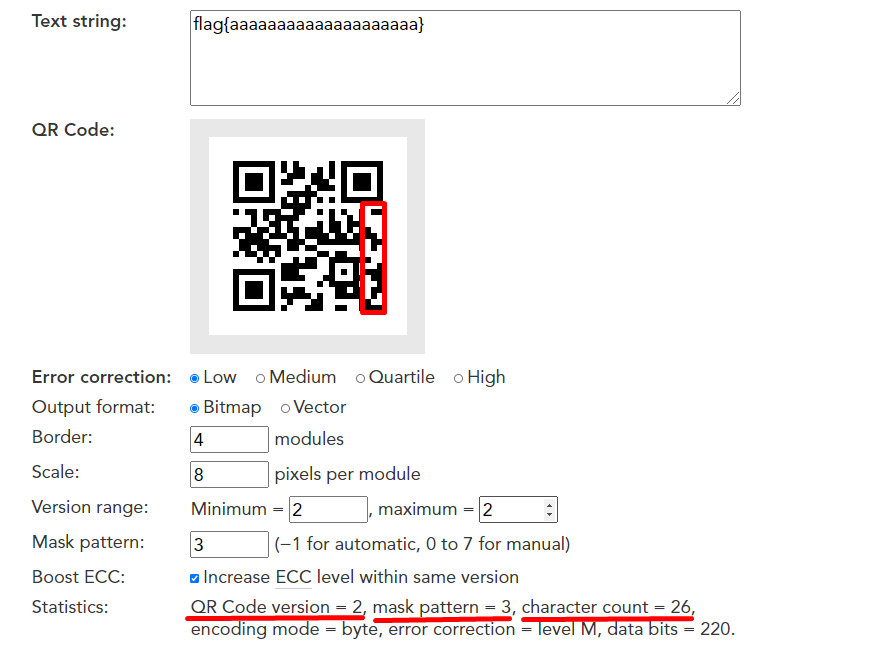
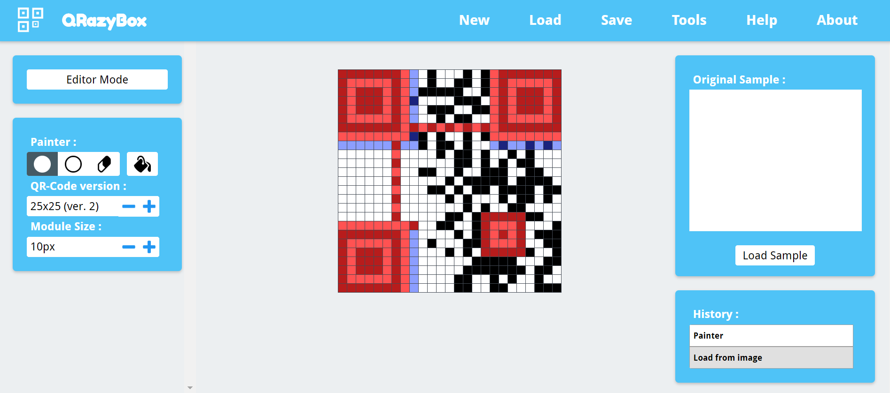
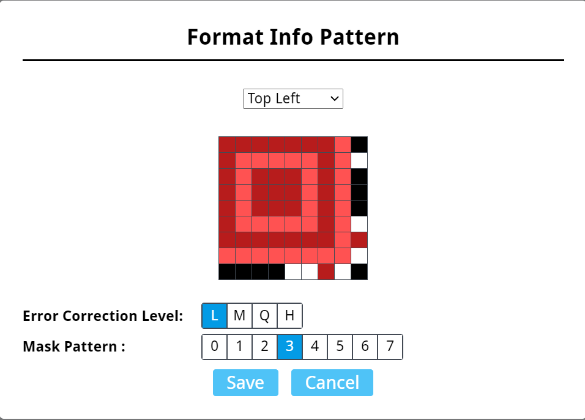
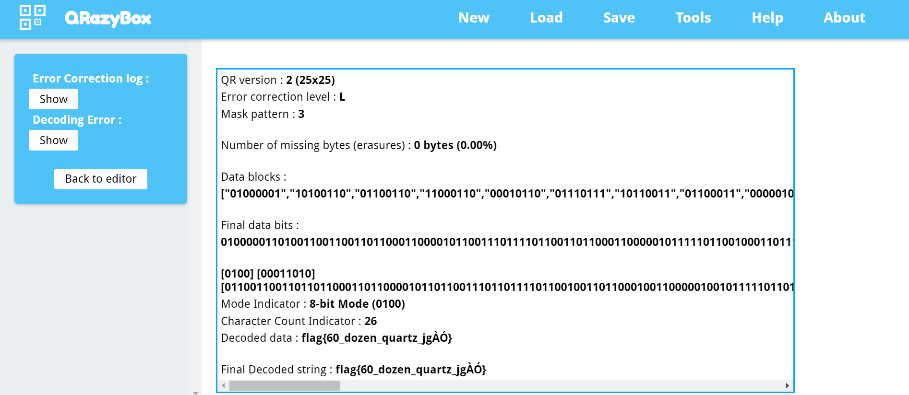

# N-95

## Problem

QR codes wear masks and so should you.

Author: AC

[Challenge File](./files/N-95.png)

## Solution

So we are faced with a broken QR code. We might have to decode this manually which would be a huge pain.

Luckily, we have an amazing tool https://merricx.github.io/qrazybox/ so we don't have to do it manually :)

We deduced it was either Version2 25x25 or Version3 29x29 QR Code. Turned out to be 25x25. All the data bits are still present. The only thing missing is the format data which includes the masking value. We could recover the data bits manually and try all the possible masking values. We can assume that it is byte/binary mode, since the flag has `{` and `}`

To make sure, that we were on the correct path we generated qr codes with different masking values until the data bits appeared to be the same. 

Using https://www.nayuki.io/page/qr-code-generator-library, encoding `flag{ random stuff }` and different mask values. We noticed that mask 3 produced the same data bits as the challenge. We then bruteforced the length as well till then right side of the qr codes matched. 

Having recovered all the format information needed, we simply needed to decode the QR Code. There was no way we were going to do this manually, too much work lmao. 

So we drew the bits we knew into the website. 

Then we set the masking value

The website then attempts to decode it ...

We got most of the flag, probably messed up something while drawing it in. Either way, we can guess the rest of the flag. 

Flag: **flag{60_dozen_quartz_jugs}**